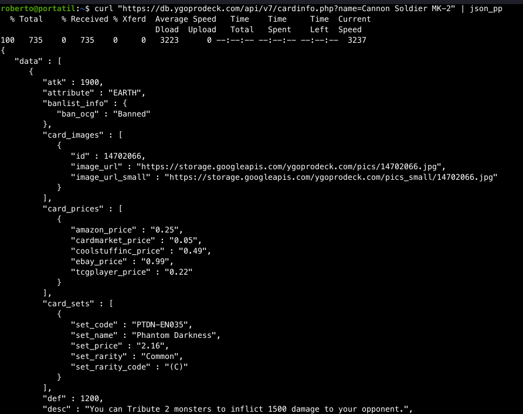
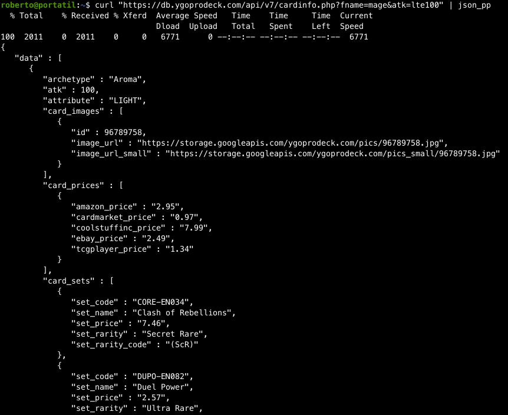
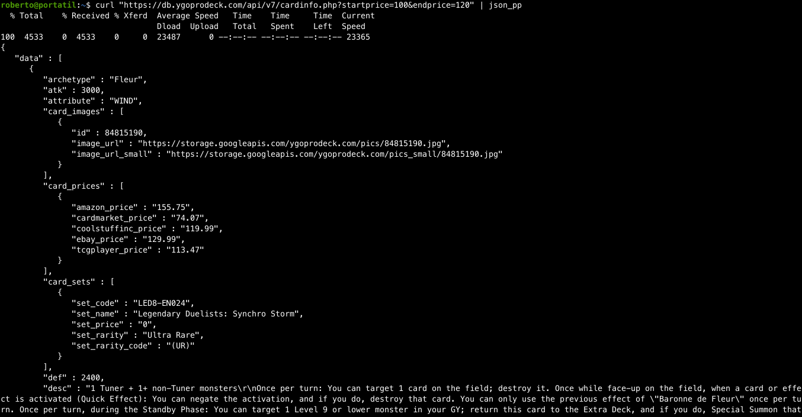
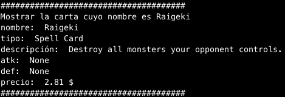
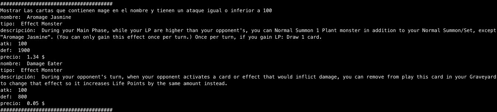
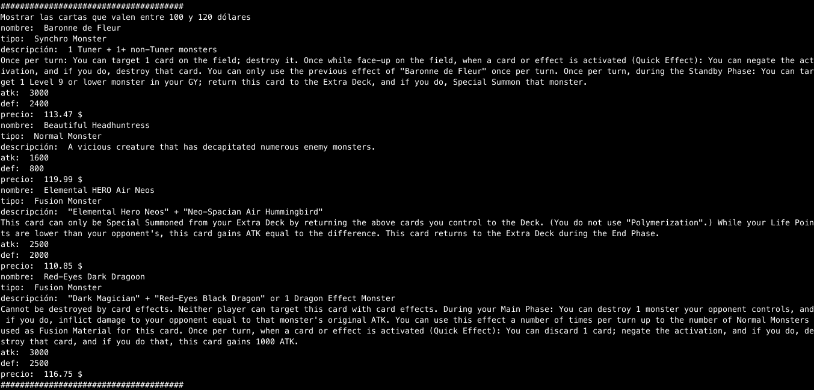

# proyectofinal [LM]
## Primera parte
### Ejecución y salida de 3 peticiones a la API principal
* Todos los datos de la carta cuyo nombre es "Cannon Soldier MK2"
 
* Las cartas que contienen "mage" en el nombre y tienen un ataque igual o inferior a 100

* Las cartas que valen entre 100 y 120 dólares

### 3 programas python que muestren información de las consultas a la API 
El fichero programa.py contiene los programas.
Pruebas de ejecución:

### Descripción de lo que va a hacer tu aplicación web utilizando estos servicios web
La aplicación utilizará la api de cartas de YuGiOh para mostrar información de las cartas a través de un bot de telegram.
###  URL de la docuementación del servicio web (o servicios) que vais a utilizar.
* Documentación de la API de cartas de YuGiOh
[https://db.ygoprodeck.com/api-guide/](https://db.ygoprodeck.com/api-guide/)
* Documentación de la API del bot de Telegram
[https://core.telegram.org/bots/api](https://core.telegram.org/bots/api)
## Segunda parte
El bot de Telegram es el siguiente
[https://t.me/yugioh_cards_bot](https://t.me/yugioh_cards_bot)
### Funciones:
* Mostrar una carta indicando su nombre. También se pueden mostrar los siguientes datos con parámetros:
    * Precios
    * Descripción
    * Arte
    * Sets en los que se puede conseguir
* Mostrar todas las cartas pertenecientes a un arquetipo. Además, aparece un desplegable que permite acceder a la vista detalle de cualquiera de las cartas mostradas.
* Mostrar una carta aleatoria, de la que luego, a través de los botones, se pueden mostrar los detalles indicados anteriormente.

